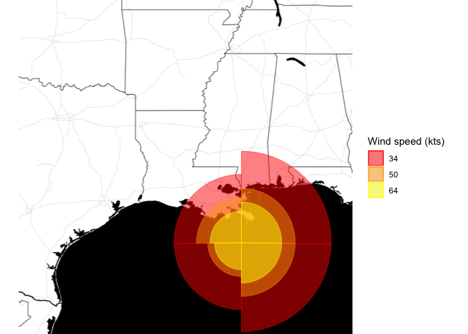

[](https://www.tidyverse.org/lifecycle/#experimental)

# Geom for Hurricanes

The purpose of this exercise is to build a new geom using `grid` and
`ggplot2` packages to facilitate in visualizing hurricane winds on a
map.

## Hurricanes

Hurricanes can have asymmetrical wind fields, with much higher winds on
one side of a storm compared to the other. Hurricane wind radii report
how far winds of a certain intensity (e.g., 34, 50, or 64 knots)
extended from a hurricane’s center, with separate values given for the
northeast, northwest, southeast, and southwest quadrants of the storm.
The 34 knot radius in the northeast quadrant, for example, reports the
furthest distance from the center of the storm of any location that
experienced 34-knot winds in that quadrant.

This wind radii data provide a clearer picture of the storm structure
than the simpler measurements of a storm’s position and maximum winds.
For example, if a storm was moving very quickly, the forward motion of
the storm might have contributed significantly to wind speeds to the
right of the storm’s direction of forward motion, and wind radii might
be much larger for the northeast quadrant of the storm than the
northwest quadrant.

## Data

The aforementioned wind radii are available for Atlantic basin tropical
storms since 1988 through the [Extended Best Tract
dataset](http://rammb.cira.colostate.edu/research/tropical_cyclones/tc_extended_best_track_dataset/)
maintained by [Colorodo State University](https://www.colostate.edu/).

### Load Data

One of the functions in this package allow us to import raw Extended
Best Track (EBTRK) data. The example data has 29 variables and 11,824
rows. The first few rows of the raw data are displayed below.

<table>

<thead>

<tr>

<th style="text-align:left;">

storm\_id

</th>

<th style="text-align:left;">

storm\_name

</th>

<th style="text-align:left;">

month

</th>

<th style="text-align:left;">

day

</th>

<th style="text-align:left;">

hour

</th>

<th style="text-align:right;">

year

</th>

<th style="text-align:right;">

latitude

</th>

<th style="text-align:right;">

longitude

</th>

<th style="text-align:right;">

max\_wind

</th>

<th style="text-align:right;">

min\_pressure

</th>

<th style="text-align:right;">

rad\_max\_wind

</th>

<th style="text-align:right;">

eye\_diameter

</th>

<th style="text-align:right;">

pressure\_1

</th>

<th style="text-align:right;">

pressure\_2

</th>

<th style="text-align:right;">

radius\_34\_ne

</th>

<th style="text-align:right;">

radius\_34\_se

</th>

<th style="text-align:right;">

radius\_34\_sw

</th>

<th style="text-align:right;">

radius\_34\_nw

</th>

<th style="text-align:right;">

radius\_50\_ne

</th>

<th style="text-align:right;">

radius\_50\_se

</th>

<th style="text-align:right;">

radius\_50\_sw

</th>

<th style="text-align:right;">

radius\_50\_nw

</th>

<th style="text-align:right;">

radius\_64\_ne

</th>

<th style="text-align:right;">

radius\_64\_se

</th>

<th style="text-align:right;">

radius\_64\_sw

</th>

<th style="text-align:right;">

radius\_64\_nw

</th>

<th style="text-align:left;">

storm\_type

</th>

<th style="text-align:right;">

distance\_to\_land

</th>

<th style="text-align:left;">

final

</th>

</tr>

</thead>

<tbody>

<tr>

<td style="text-align:left;">

AL0188

</td>

<td style="text-align:left;">

ALBERTO

</td>

<td style="text-align:left;">

08

</td>

<td style="text-align:left;">

05

</td>

<td style="text-align:left;">

18

</td>

<td style="text-align:right;">

1988

</td>

<td style="text-align:right;">

32.0

</td>

<td style="text-align:right;">

77.5

</td>

<td style="text-align:right;">

20

</td>

<td style="text-align:right;">

1015

</td>

<td style="text-align:right;">

NA

</td>

<td style="text-align:right;">

NA

</td>

<td style="text-align:right;">

NA

</td>

<td style="text-align:right;">

NA

</td>

<td style="text-align:right;">

0

</td>

<td style="text-align:right;">

0

</td>

<td style="text-align:right;">

0

</td>

<td style="text-align:right;">

0

</td>

<td style="text-align:right;">

0

</td>

<td style="text-align:right;">

0

</td>

<td style="text-align:right;">

0

</td>

<td style="text-align:right;">

0

</td>

<td style="text-align:right;">

0

</td>

<td style="text-align:right;">

0

</td>

<td style="text-align:right;">

0

</td>

<td style="text-align:right;">

0

</td>

<td style="text-align:left;">

  - 
    
    </td>
    
    <td style="text-align:right;">
    
    218
    
    </td>
    
    <td style="text-align:left;">
    
    .
    
    </td>
    
    </tr>
    
    <tr>
    
    <td style="text-align:left;">
    
    AL0188
    
    </td>
    
    <td style="text-align:left;">
    
    ALBERTO
    
    </td>
    
    <td style="text-align:left;">
    
    08
    
    </td>
    
    <td style="text-align:left;">
    
    06
    
    </td>
    
    <td style="text-align:left;">
    
    00
    
    </td>
    
    <td style="text-align:right;">
    
    1988
    
    </td>
    
    <td style="text-align:right;">
    
    32.8
    
    </td>
    
    <td style="text-align:right;">
    
    76.2
    
    </td>
    
    <td style="text-align:right;">
    
    20
    
    </td>
    
    <td style="text-align:right;">
    
    1014
    
    </td>
    
    <td style="text-align:right;">
    
    NA
    
    </td>
    
    <td style="text-align:right;">
    
    NA
    
    </td>
    
    <td style="text-align:right;">
    
    NA
    
    </td>
    
    <td style="text-align:right;">
    
    NA
    
    </td>
    
    <td style="text-align:right;">
    
    0
    
    </td>
    
    <td style="text-align:right;">
    
    0
    
    </td>
    
    <td style="text-align:right;">
    
    0
    
    </td>
    
    <td style="text-align:right;">
    
    0
    
    </td>
    
    <td style="text-align:right;">
    
    0
    
    </td>
    
    <td style="text-align:right;">
    
    0
    
    </td>
    
    <td style="text-align:right;">
    
    0
    
    </td>
    
    <td style="text-align:right;">
    
    0
    
    </td>
    
    <td style="text-align:right;">
    
    0
    
    </td>
    
    <td style="text-align:right;">
    
    0
    
    </td>
    
    <td style="text-align:right;">
    
    0
    
    </td>
    
    <td style="text-align:right;">
    
    0
    
    </td>
    
    <td style="text-align:left;">
    
      - 
        
        </td>
        
        <td style="text-align:right;">
        
        213
        
        </td>
        
        <td style="text-align:left;">
        
        .
        
        </td>
        
        </tr>
        
        <tr>
        
        <td style="text-align:left;">
        
        AL0188
        
        </td>
        
        <td style="text-align:left;">
        
        ALBERTO
        
        </td>
        
        <td style="text-align:left;">
        
        08
        
        </td>
        
        <td style="text-align:left;">
        
        06
        
        </td>
        
        <td style="text-align:left;">
        
        06
        
        </td>
        
        <td style="text-align:right;">
        
        1988
        
        </td>
        
        <td style="text-align:right;">
        
        34.0
        
        </td>
        
        <td style="text-align:right;">
        
        75.2
        
        </td>
        
        <td style="text-align:right;">
        
        20
        
        </td>
        
        <td style="text-align:right;">
        
        1013
        
        </td>
        
        <td style="text-align:right;">
        
        NA
        
        </td>
        
        <td style="text-align:right;">
        
        NA
        
        </td>
        
        <td style="text-align:right;">
        
        NA
        
        </td>
        
        <td style="text-align:right;">
        
        NA
        
        </td>
        
        <td style="text-align:right;">
        
        0
        
        </td>
        
        <td style="text-align:right;">
        
        0
        
        </td>
        
        <td style="text-align:right;">
        
        0
        
        </td>
        
        <td style="text-align:right;">
        
        0
        
        </td>
        
        <td style="text-align:right;">
        
        0
        
        </td>
        
        <td style="text-align:right;">
        
        0
        
        </td>
        
        <td style="text-align:right;">
        
        0
        
        </td>
        
        <td style="text-align:right;">
        
        0
        
        </td>
        
        <td style="text-align:right;">
        
        0
        
        </td>
        
        <td style="text-align:right;">
        
        0
        
        </td>
        
        <td style="text-align:right;">
        
        0
        
        </td>
        
        <td style="text-align:right;">
        
        0
        
        </td>
        
        <td style="text-align:left;">
        
          - 
            
            </td>
            
            <td style="text-align:right;">
            
            149
            
            </td>
            
            <td style="text-align:left;">
            
            .
            
            </td>
            
            </tr>
            
            <tr>
            
            <td style="text-align:left;">
            
            AL0188
            
            </td>
            
            <td style="text-align:left;">
            
            ALBERTO
            
            </td>
            
            <td style="text-align:left;">
            
            08
            
            </td>
            
            <td style="text-align:left;">
            
            06
            
            </td>
            
            <td style="text-align:left;">
            
            12
            
            </td>
            
            <td style="text-align:right;">
            
            1988
            
            </td>
            
            <td style="text-align:right;">
            
            35.2
            
            </td>
            
            <td style="text-align:right;">
            
            74.6
            
            </td>
            
            <td style="text-align:right;">
            
            25
            
            </td>
            
            <td style="text-align:right;">
            
            1012
            
            </td>
            
            <td style="text-align:right;">
            
            NA
            
            </td>
            
            <td style="text-align:right;">
            
            NA
            
            </td>
            
            <td style="text-align:right;">
            
            NA
            
            </td>
            
            <td style="text-align:right;">
            
            NA
            
            </td>
            
            <td style="text-align:right;">
            
            0
            
            </td>
            
            <td style="text-align:right;">
            
            0
            
            </td>
            
            <td style="text-align:right;">
            
            0
            
            </td>
            
            <td style="text-align:right;">
            
            0
            
            </td>
            
            <td style="text-align:right;">
            
            0
            
            </td>
            
            <td style="text-align:right;">
            
            0
            
            </td>
            
            <td style="text-align:right;">
            
            0
            
            </td>
            
            <td style="text-align:right;">
            
            0
            
            </td>
            
            <td style="text-align:right;">
            
            0
            
            </td>
            
            <td style="text-align:right;">
            
            0
            
            </td>
            
            <td style="text-align:right;">
            
            0
            
            </td>
            
            <td style="text-align:right;">
            
            0
            
            </td>
            
            <td style="text-align:left;">
            
              - 
                
                </td>
                
                <td style="text-align:right;">
                
                126
                
                </td>
                
                <td style="text-align:left;">
                
                .
                
                </td>
                
                </tr>
                
                <tr>
                
                <td style="text-align:left;">
                
                AL0188
                
                </td>
                
                <td style="text-align:left;">
                
                ALBERTO
                
                </td>
                
                <td style="text-align:left;">
                
                08
                
                </td>
                
                <td style="text-align:left;">
                
                06
                
                </td>
                
                <td style="text-align:left;">
                
                18
                
                </td>
                
                <td style="text-align:right;">
                
                1988
                
                </td>
                
                <td style="text-align:right;">
                
                37.0
                
                </td>
                
                <td style="text-align:right;">
                
                73.5
                
                </td>
                
                <td style="text-align:right;">
                
                25
                
                </td>
                
                <td style="text-align:right;">
                
                1011
                
                </td>
                
                <td style="text-align:right;">
                
                NA
                
                </td>
                
                <td style="text-align:right;">
                
                NA
                
                </td>
                
                <td style="text-align:right;">
                
                NA
                
                </td>
                
                <td style="text-align:right;">
                
                NA
                
                </td>
                
                <td style="text-align:right;">
                
                0
                
                </td>
                
                <td style="text-align:right;">
                
                0
                
                </td>
                
                <td style="text-align:right;">
                
                0
                
                </td>
                
                <td style="text-align:right;">
                
                0
                
                </td>
                
                <td style="text-align:right;">
                
                0
                
                </td>
                
                <td style="text-align:right;">
                
                0
                
                </td>
                
                <td style="text-align:right;">
                
                0
                
                </td>
                
                <td style="text-align:right;">
                
                0
                
                </td>
                
                <td style="text-align:right;">
                
                0
                
                </td>
                
                <td style="text-align:right;">
                
                0
                
                </td>
                
                <td style="text-align:right;">
                
                0
                
                </td>
                
                <td style="text-align:right;">
                
                0
                
                </td>
                
                <td style="text-align:left;">
                
                  - 
                    
                    </td>
                    
                    <td style="text-align:right;">
                    
                    197
                    
                    </td>
                    
                    <td style="text-align:left;">
                    
                    .
                    
                    </td>
                    
                    </tr>
                    
                    <tr>
                    
                    <td style="text-align:left;">
                    
                    AL0188
                    
                    </td>
                    
                    <td style="text-align:left;">
                    
                    ALBERTO
                    
                    </td>
                    
                    <td style="text-align:left;">
                    
                    08
                    
                    </td>
                    
                    <td style="text-align:left;">
                    
                    07
                    
                    </td>
                    
                    <td style="text-align:left;">
                    
                    00
                    
                    </td>
                    
                    <td style="text-align:right;">
                    
                    1988
                    
                    </td>
                    
                    <td style="text-align:right;">
                    
                    38.7
                    
                    </td>
                    
                    <td style="text-align:right;">
                    
                    72.4
                    
                    </td>
                    
                    <td style="text-align:right;">
                    
                    25
                    
                    </td>
                    
                    <td style="text-align:right;">
                    
                    1009
                    
                    </td>
                    
                    <td style="text-align:right;">
                    
                    NA
                    
                    </td>
                    
                    <td style="text-align:right;">
                    
                    NA
                    
                    </td>
                    
                    <td style="text-align:right;">
                    
                    NA
                    
                    </td>
                    
                    <td style="text-align:right;">
                    
                    NA
                    
                    </td>
                    
                    <td style="text-align:right;">
                    
                    0
                    
                    </td>
                    
                    <td style="text-align:right;">
                    
                    0
                    
                    </td>
                    
                    <td style="text-align:right;">
                    
                    0
                    
                    </td>
                    
                    <td style="text-align:right;">
                    
                    0
                    
                    </td>
                    
                    <td style="text-align:right;">
                    
                    0
                    
                    </td>
                    
                    <td style="text-align:right;">
                    
                    0
                    
                    </td>
                    
                    <td style="text-align:right;">
                    
                    0
                    
                    </td>
                    
                    <td style="text-align:right;">
                    
                    0
                    
                    </td>
                    
                    <td style="text-align:right;">
                    
                    0
                    
                    </td>
                    
                    <td style="text-align:right;">
                    
                    0
                    
                    </td>
                    
                    <td style="text-align:right;">
                    
                    0
                    
                    </td>
                    
                    <td style="text-align:right;">
                    
                    0
                    
                    </td>
                    
                    <td style="text-align:left;">
                    
                      - 
                        
                        </td>
                        
                        <td style="text-align:right;">
                        
                        193
                        
                        </td>
                        
                        <td style="text-align:left;">
                        
                        .
                        
                        </td>
                        
                        </tr>
                        
                        </tbody>
                        
                        </table>

### Tidy Data

We also need to “tidy” the data and format it to be used with
`geom_hurricane`. As such, the `data_tidy` function allows the user to
do so. The first few rows of the tidy data are presented below.

<table>

<thead>

<tr>

<th style="text-align:left;">

storm\_id

</th>

<th style="text-align:left;">

date

</th>

<th style="text-align:right;">

latitude

</th>

<th style="text-align:right;">

longitude

</th>

<th style="text-align:left;">

wind\_speed

</th>

<th style="text-align:right;">

ne

</th>

<th style="text-align:right;">

se

</th>

<th style="text-align:right;">

sw

</th>

<th style="text-align:right;">

nw

</th>

</tr>

</thead>

<tbody>

<tr>

<td style="text-align:left;">

Alberto-1988

</td>

<td style="text-align:left;">

1988-08-05 18:00:00

</td>

<td style="text-align:right;">

32.0

</td>

<td style="text-align:right;">

\-77.5

</td>

<td style="text-align:left;">

34

</td>

<td style="text-align:right;">

0

</td>

<td style="text-align:right;">

0

</td>

<td style="text-align:right;">

0

</td>

<td style="text-align:right;">

0

</td>

</tr>

<tr>

<td style="text-align:left;">

Alberto-1988

</td>

<td style="text-align:left;">

1988-08-05 18:00:00

</td>

<td style="text-align:right;">

32.0

</td>

<td style="text-align:right;">

\-77.5

</td>

<td style="text-align:left;">

50

</td>

<td style="text-align:right;">

0

</td>

<td style="text-align:right;">

0

</td>

<td style="text-align:right;">

0

</td>

<td style="text-align:right;">

0

</td>

</tr>

<tr>

<td style="text-align:left;">

Alberto-1988

</td>

<td style="text-align:left;">

1988-08-05 18:00:00

</td>

<td style="text-align:right;">

32.0

</td>

<td style="text-align:right;">

\-77.5

</td>

<td style="text-align:left;">

64

</td>

<td style="text-align:right;">

0

</td>

<td style="text-align:right;">

0

</td>

<td style="text-align:right;">

0

</td>

<td style="text-align:right;">

0

</td>

</tr>

<tr>

<td style="text-align:left;">

Alberto-1988

</td>

<td style="text-align:left;">

1988-08-06 00:00:00

</td>

<td style="text-align:right;">

32.8

</td>

<td style="text-align:right;">

\-76.2

</td>

<td style="text-align:left;">

34

</td>

<td style="text-align:right;">

0

</td>

<td style="text-align:right;">

0

</td>

<td style="text-align:right;">

0

</td>

<td style="text-align:right;">

0

</td>

</tr>

<tr>

<td style="text-align:left;">

Alberto-1988

</td>

<td style="text-align:left;">

1988-08-06 00:00:00

</td>

<td style="text-align:right;">

32.8

</td>

<td style="text-align:right;">

\-76.2

</td>

<td style="text-align:left;">

50

</td>

<td style="text-align:right;">

0

</td>

<td style="text-align:right;">

0

</td>

<td style="text-align:right;">

0

</td>

<td style="text-align:right;">

0

</td>

</tr>

<tr>

<td style="text-align:left;">

Alberto-1988

</td>

<td style="text-align:left;">

1988-08-06 00:00:00

</td>

<td style="text-align:right;">

32.8

</td>

<td style="text-align:right;">

\-76.2

</td>

<td style="text-align:left;">

64

</td>

<td style="text-align:right;">

0

</td>

<td style="text-align:right;">

0

</td>

<td style="text-align:right;">

0

</td>

<td style="text-align:right;">

0

</td>

</tr>

</tbody>

</table>

### Select Hurricane

Finally, the `data_filter_hurricane` function allows the user to select
the hurricane that needs to be plotted.

> Hurricane names are recycled. Therefore, the user needs to specify the
> year of the hurricane.

The example below shows the filtered and formatted tidy data for the

<table>

<thead>

<tr>

<th style="text-align:left;">

storm\_id

</th>

<th style="text-align:left;">

date

</th>

<th style="text-align:right;">

latitude

</th>

<th style="text-align:right;">

longitude

</th>

<th style="text-align:left;">

wind\_speed

</th>

<th style="text-align:right;">

ne

</th>

<th style="text-align:right;">

se

</th>

<th style="text-align:right;">

sw

</th>

<th style="text-align:right;">

nw

</th>

</tr>

</thead>

<tbody>

<tr>

<td style="text-align:left;">

Katrina-2005

</td>

<td style="text-align:left;">

2005-08-25 12:00:00

</td>

<td style="text-align:right;">

26.2

</td>

<td style="text-align:right;">

\-79.0

</td>

<td style="text-align:left;">

34

</td>

<td style="text-align:right;">

60

</td>

<td style="text-align:right;">

60

</td>

<td style="text-align:right;">

30

</td>

<td style="text-align:right;">

50

</td>

</tr>

<tr>

<td style="text-align:left;">

Katrina-2005

</td>

<td style="text-align:left;">

2005-08-25 18:00:00

</td>

<td style="text-align:right;">

26.2

</td>

<td style="text-align:right;">

\-79.6

</td>

<td style="text-align:left;">

34

</td>

<td style="text-align:right;">

70

</td>

<td style="text-align:right;">

70

</td>

<td style="text-align:right;">

50

</td>

<td style="text-align:right;">

60

</td>

</tr>

<tr>

<td style="text-align:left;">

Katrina-2005

</td>

<td style="text-align:left;">

2005-08-25 18:00:00

</td>

<td style="text-align:right;">

26.2

</td>

<td style="text-align:right;">

\-79.6

</td>

<td style="text-align:left;">

50

</td>

<td style="text-align:right;">

25

</td>

<td style="text-align:right;">

25

</td>

<td style="text-align:right;">

20

</td>

<td style="text-align:right;">

20

</td>

</tr>

<tr>

<td style="text-align:left;">

Katrina-2005

</td>

<td style="text-align:left;">

2005-08-26 00:00:00

</td>

<td style="text-align:right;">

25.9

</td>

<td style="text-align:right;">

\-80.3

</td>

<td style="text-align:left;">

34

</td>

<td style="text-align:right;">

70

</td>

<td style="text-align:right;">

70

</td>

<td style="text-align:right;">

50

</td>

<td style="text-align:right;">

40

</td>

</tr>

<tr>

<td style="text-align:left;">

Katrina-2005

</td>

<td style="text-align:left;">

2005-08-26 00:00:00

</td>

<td style="text-align:right;">

25.9

</td>

<td style="text-align:right;">

\-80.3

</td>

<td style="text-align:left;">

50

</td>

<td style="text-align:right;">

20

</td>

<td style="text-align:right;">

20

</td>

<td style="text-align:right;">

20

</td>

<td style="text-align:right;">

20

</td>

</tr>

<tr>

<td style="text-align:left;">

Katrina-2005

</td>

<td style="text-align:left;">

2005-08-26 00:00:00

</td>

<td style="text-align:right;">

25.9

</td>

<td style="text-align:right;">

\-80.3

</td>

<td style="text-align:left;">

64

</td>

<td style="text-align:right;">

10

</td>

<td style="text-align:right;">

10

</td>

<td style="text-align:right;">

10

</td>

<td style="text-align:right;">

10

</td>

</tr>

</tbody>

</table>

## Example

**Landfall**

Hurricane Katrina appeared to make [landfall on October 29, 2005
around 6 AM
CDT](https://en.wikipedia.org/wiki/Timeline_of_Hurricane_Katrina#Second_and_Third_landfall).
We will filter the data highlited above and plot the hurricane geom to
visualize the wind speeds as it made landfall in Louisiana.

``` r
library(ggmap)
get_map("Louisiana", zoom = 6, maptype = "toner-background") %>%
  ggmap(extent = "device") +
  geom_hurricane(data = katrina_lf,
                 aes(x = longitude, y = latitude, 
                     r_ne = ne, r_se = se, r_nw = nw, r_sw = sw,
                     fill = wind_speed, color = wind_speed),
                 alpha = 0.5) + 
  scale_color_manual(name = "Wind speed (kts)", 
                     values = c("red", "orange", "yellow")) + 
  scale_fill_manual(name = "Wind speed (kts)", 
                    values = c("red", "orange", "yellow"))
```

<!-- -->

**Hurricane Path** The path of the hurricane can be seen in the
animation below.

``` r
library(gganimate)
library(gifski)
library(magick)

hurricane_path <- 
    get_map("Jacksonville", zoom = 5, maptype = "hybrid") %>%
    ggmap(extent = "device") +
    geom_hurricane(data = katrina,
                   aes(x = longitude, y = latitude, 
                     r_ne = ne, r_se = se, r_nw = nw, r_sw = sw,
                     fill = wind_speed, color = wind_speed),
                 alpha = 0.5) + 
  scale_color_manual(name = "Wind speed (kts)", 
                     values = c("red", "orange", "yellow")) + 
  scale_fill_manual(name = "Wind speed (kts)", 
                    values = c("red", "orange", "yellow")) +
  transition_time(date) +
  ease_aes('linear')

animate(hurricane_path, renderer = magick_renderer())
```

<!-- -->
